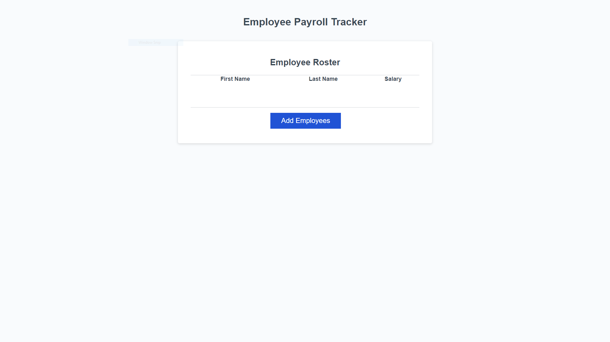
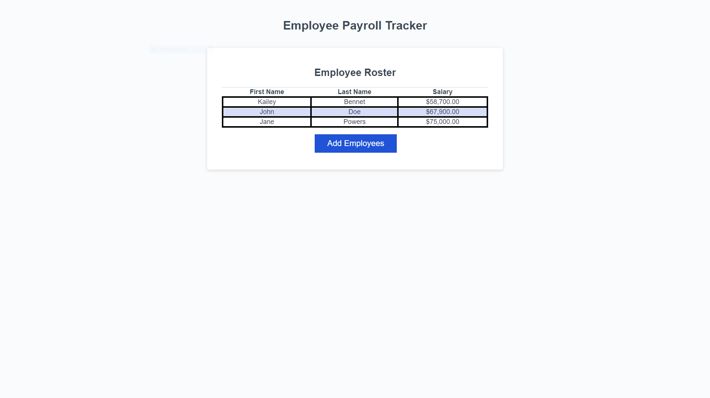
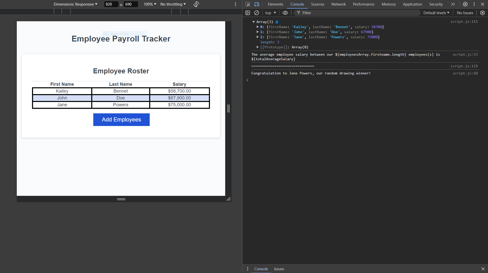

# module-3-challenge-employee-payroll

contact me:
    email: zabirsarwar@yahoo.com
    GitHub: zzbrooks

1. I modified existing code to ask for user input using the prompt function

2. i created an empty array that would collect the data of the employees

3. the data collected:
    -first name
    -last name
    -salary

4. i added to the arrays by using the push method for arrays

5. after the data is added to the empty array, i created the code blocks for 2 other functions

6. the variable displayAverageSalary contains the function that will give the averge salary for all the employees

7. then the average salary is console logged into a statement

8. the variable getRandomEmployee containing a function will perform a random drawing 

9. this function was created using the Math.random function along with other code that would randomly select an employee to win

10. the winner was console logged inside an statement

how the deployed site looks like:

